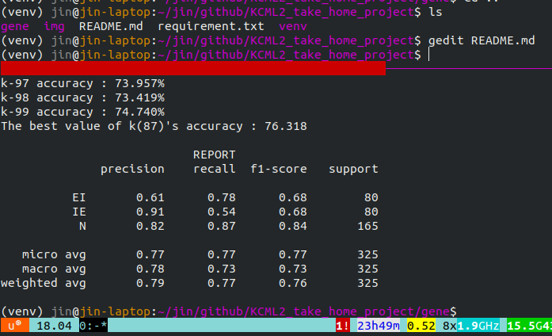
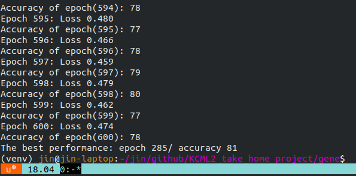
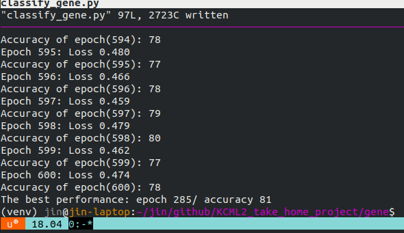
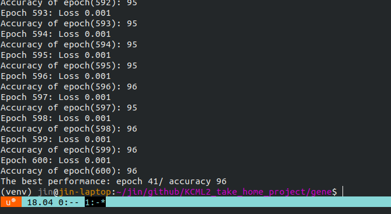

# KCML2_take_home_project
Goal: to generate a model to classify a gene sequence into the three categories(IE/EI/N)
Dataset by [UCI ML repo](https://archive.ics.uci.edu/ml/datasets/Molecular+Biology+%28Splice-junction+Gene+Sequences%29).

## Final Accuracy


## How to Use This Program
clone this repository
```
YOUR_DIR/KCML2_take_home_project$virtualenv venv -p python3
YOUR_DIR/KCML2_take_home_project$. venv/bin/activate
(venv) YOUR_DIR/KCML2_take_home_project$pip install -r requirement.txt
(venv) YOUR_DIR/KCML2_take_home_project$cd gene
(venv) YOUR_DIR/KCML2_take_home_project/gene$ python classify_gene.py
```
Check the final result!

## Dataset Inspection
Total number of instances: 3190

Number of attributes: 62(class/instance name/gene sequence)

Domains of gene sequence: A/T/G/C and D/N/S/R(ambiguity among A/T/G/C)
  - D: A, G, or T
  - N: A, G, C, or T
  - S: C or G
  - R: A or G

## Class Inspection
### EI (Exon->Intron)
EI defined by a short sequence arround the boundary/the absence of a stop codon on the exon side of the boundary.

  - short sequence: @-3 `MAGGTRAGT`
  - EI stop codon
    - @-3 `TAA`, `TAG`, `TGA`
    - @-4 `TAA`, `TAG`, `TGA`
    - @-5 `TAA`, `TAG`, `TGA`

### IE (Intron->Exon)
IE defined by a short sequence around the boundary/the absence of a stop codon immediately following the boundary/a pryamidine rich region preceeding the boundary.

  - short sequence: @-3 `YAGG`
  - pryamidine rich region: 6 of (@-15 `YYYYYYYYYY`)
  - IE stop codon
    - @-1 `TAA`
    - @-2 `TAG`
    - @-3 `TGA`
    - @-4 `TAA`
    - @-5 `TAG`
    - @-6 `TGA`
    - @-7 `TAA`
    - @-8 `TAG`
    - @-9 `TGA`

### N (Neither)
N does not belong to both above.

## Dataset Manager
I implement a dataset manager. It provides testset and trainset as 1-dim tensors or 2-dim tensors with labels. When it return 2-dim datasets, the data are returned as 8x8 tensor. I applied CNN with these data.

The testset is about 10% of each class. This manager splits the data for testset and trainset: EI(687/80), IE(688/80), N(1490/165). The total number of data is 3190(2865 to train/325 to test)

## Model Description
### KNN
This is the baseline for comparison between a classic ML method and NN methods. Its best performance is 76% (f1-score, 2*(precision*recall)/(precision+recall)).



### NN2
NN2 consists of 2 linear layers and is the baseline of this project. Its best performance is 81%.


### NN3
NN3 consists of 3 linear layers. Its best performance is 81%.


### vgg3
Vgg3 consists of 2 conv layers and 1 linear layer. Its best performance is 94%.


### vgg5
Vgg5 consists of 4 conv layers and 1 linear layer. Its best performance is 88%.


### Only with convolutional layers
CNN model with only convolution layers (without pooling layers btw the convolutions) showed 96% accuracy.


## Futher work to improve the performance
### Preventing overfitting
I consider data augmentation techniques to prvent overfitting with complex models. This is because the provided dataset is so small that the complex model can be easily overfitted to the training data. Some ways to augment the data are below.
  - use D/N/S/R: D/N/S/R can be replaced by A/T/G/C. If one instance has 3N, the instance can be augmented from 1 to 4^3. However, the features such as stop codons of each class must be considered.
  - pad and crop gene sequence: This can be used to augment data. However, the head/tail information of gene is usually critical, so I'm not sure this can be helpful.
  - apply cross-validation: cross-validation might reduce the risk of overfitting. Although cross validation is considered expensive (for k fold, training & testing k-times), my model isn't so complicated that this can be a way to prevent overfitting.

### Adjusting data distribution
The dataset has IE(25%), EI(25%), and N(50%). Because of its proportion, the classifier will work better with N class. To ensure the performance for all classes, it can be conducive to use same number of class instances. However, my testset is also disproportionate. So, it does not matter now.

### Initializing the parameters of models
According some papers such as [this](https://arxiv.org/pdf/1704.08863.pdf), the insigts of weight initializtion comes from the linear activation functions. After checking the [source code](https://github.com/pytorch/pytorch/blob/master/torch/nn/init.py) of pytorch, I realized that pytorch also uses the xavier initializtion.

The xavier initializes weight parameters by using samples from a normal distribution N(0, V^2). The V^2 of Xavier is 1/N, N is # of nodes feeding into that layer, but this value may not be the best option for weight initializtion. The better initializtion can improve the performance of a model, and it is showed by [this paper](https://www.cv-foundation.org/openaccess/content_iccv_2015/papers/He_Delving_Deep_into_ICCV_2015_paper.pdf). Even though I'm not sure that my model for this dataset can be improved because it is so simple, it is worth to apply another V^2 values such as 2/N^2.
